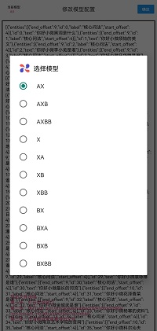

# 文本标注工具-Android(模型数据生成器)介绍

### 主要是为了方便对提供的前缀、后缀、主干数据进行所有可能性组合，且标注出主干数据在整体语句中的头尾索引，生成对应的json数据模型。[点击下载 Apk 体验](https://raw.githubusercontent.com/yyds-zy/ModeBuilder/master/app/debug/ModeBuilder.apk)，又或者扫码下载

#### 一、安装模型数据生成器后存在默认的模型配置：

**前缀：**

{"你好小微", "小微", "小微小微", "嗨小微",
"你好小薇", "小薇", "小薇小薇", "嗨小薇"}

**主干：**

{"黑洞是什么","烦恼的英文","李小龙是谁","马华腾是谁",
"任正非是谁","彭德文是谁","刘强东是谁","美国的上任总统",
"五角大楼在哪里","中国海拔最高的城市","中国最高的山脉","罗凯楠是谁",
"郑光祖的代表作品","黄河的发源地","杰克船长的饰演者是谁","宋亚轩是谁",
"爱因斯坦是谁","美国总统是谁","上海的经纬度","日本的国歌",
"中国的国家主席是谁","习近平的生日","欧阳娜娜是谁","我国最大的瀑布",
"五岳是什么","菲尔普斯是谁","王守义是谁","袁隆平是谁",
"中国第二大瀑布","袁咏琳是谁","最长的河流","花泽香菜是谁",
"金城武是谁","杨幂的资料","南京艺术学院的官网","科尔沁夫的话",
"李小璐是谁","贾乃亮是谁","安吉丽娜是谁","美国自由女神像是谁",
"李白的古诗","四大名著的作者","人民币美元汇率","白宇是谁",
"郭麒麟是谁","西红市首富","哈尔滨工业大学","谁是萨特",
"刀马旦是什么","满文军的代表作"}

**后缀：**

{"阿", "啊", "啦", "唉", "哎", "呢", "吧",
"罢", "呵", "哈", "了", "哇", "呀", "吖",
"吗", "嘛", "哪", "哦", "噢", "喔", "哈",
"呐", "哩", "咧", "哟", "嘞", "耶", "噻",
"呗", "咯", "啰", "喽", "呕", "呦", "么",
"麽", "嗯", "啵", "呃", "来", "唻", "不",
"的"}

#### 二、多种模型类型选择

##### 模型类型：

- **A表示前缀，X表示主干，B表示后缀**

- AX、AXB、AXBB、X、 XA、XB、XBB、BX、BXA、BXB、BXBB

- BXBB情况下，BB相同

#### 三、修改模型配置

1. 按照默认存在的模型信息（前缀、后缀、主干）格式，将自己需要的对应格式放入到模型数据生成器的模型配置界面，点击确定。看到设置成功的提示后即可；

2. 可以通过点击模型示例查看需要填入的模型信息格式。

#### 四、模型切换

1. 在主HOME页左上角可以看到当前模型，点击确定即可生成当前模型数据；

2. 点击当前模型可以选择切换模型。

#### 五、导出模型数据

- 方案一：在手机的文件管理中选择我的手机 →  Android  →  data → com.tencent.mobuilder → files → ModeFile 将此文件夹下所有文件拷贝出来即可

- 方案二：电脑连接手机通过adb工具执行adb pull /storage/emulated/0/Android/data/com.tencent.modebuilder/files/ModeFile/

#### 六、软件截图
  
 
